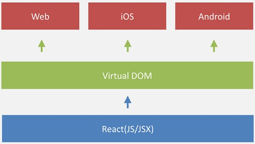
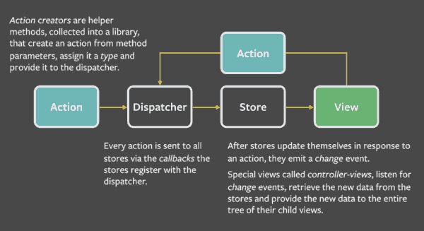

title: React Native Overview
author:
   name: Kasper Deng
   url: http://kasperdeng.github.io
<!--(theme: sudodoki/reveal-cleaver-theme)-->
theme: ../../_cleaver_theme/reveal-cleaver-theme
output: react-native-overview.html
encoding: utf-8

--

# React-Native

## Learn once, write anywhere: Build mobile apps with React

--

### React
* [ReactJs](https://facebook.github.io/react/) & [React Native](https://facebook.github.io/react-native/)
  - derives from Facebook
  - UI library
* pain point
  - render performance
  - logic complexity
  - data flow & state machine

--

### ReactJs
* Solution
  - veritual DOM
  - modulization in UI - component
    + interactive
    + stateful
    + reusable
  - Flux

--

### ReactJs
* Learn once, write anywhere

--

### ReactJs
* [JSX](http://facebook.github.io/react/docs/displaying-data.html#jsx-syntax)

--

### ReactJS
#### ES6/ES2015

--

### React Native

* Native App (independent UI render threads) not Hybrid App (business logic shared with UI render thread)
  - Good expreience on native control component
  - Good experience on guesture and UI interaction
  - Good thread model (multi-threaded rendering, performance)
* Share most web-app code to write native app

--

### React Native
* React is just view
* Most logic implementation still using Java as that in existing android dev
* React native provides bridge to platform native API and native modules

--

### Advantage & Benefit
* Dev Efficiency
  - Developer only focus on the react component and data transition
  - Instead of recompiling, app UI reload instantly to reflect the changes
* Code Prospective
  - modulization: reusable, logic clear 
* Render Performance
  - DOM structure is managed by React and in efficiently update the changed component

--

### Disadvantage
* React in quick dev-iterator, not fully mature yet
* some apis not backward compatible

--

## React  Ecosystem
* [React: complementatry tools](https://github.com/facebook/react/wiki/Complementary-Tools#full-stack-starter-kits)
* https://react.parts/native

--

## React Framework
* React is just view
* [Flux](http://facebook.github.io/flux/): data flows unidirectional

--

### 慌毛，来学Javascript

* [阮一峰 - ECMAScript 6入门](http://es6.ruanyifeng.com/)

--

### Reference
* [React Learning Roadmap](https://github.com/wwsun/awesome-javascript/tree/master/sections/React)
* [浅析 Facebook Flux 架构](http://undefinedblog.com/facebook-flux/)
* [前端Flux架构简介](http://www.jdon.com/idea/flux.html)
* [图解 Flux](http://zhuanlan.zhihu.com/FrontendMagazine/20263396)
* [ES6新特性概览](http://www.cnblogs.com/Wayou/p/es6_new_features.html)
* [ES6 features](https://github.com/lukehoban/es6features#readme)

